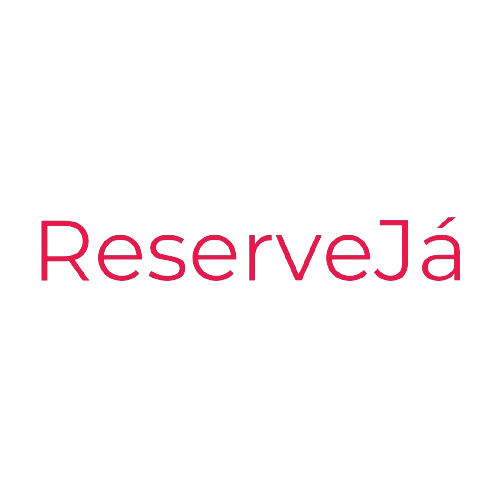

  

# Sobre

ReserveJá é uma plataforma para reservas de restaurantes utilizando Django e o Django Rest Framework para API . A reserva é feita de forma
fácil e rápida e que pode ser realizada com o restaurante de sua escolha . Além disso, contamos com uma sessão de comentários para o cliente
ter uma noção mínima caso seja a primeira vez .

# Licença

Código licenciado sob <a href="https://github.com/danielcerk/reserveja/blob/main/LICENSE">Licença MIT</a>

